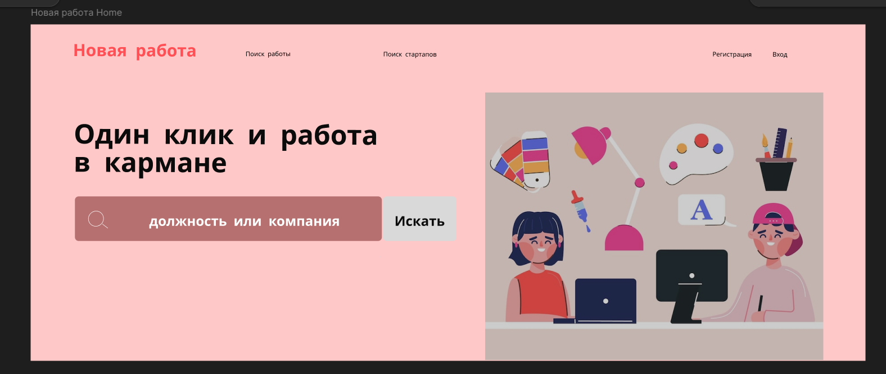

# Проект: Поиск Работы

## Описание
В этом репозитории находится мой первый макет, созданный в Figma. На макете изображён дизайн будущего сайта для поиска работы. Этот сайт будет помогать пользователям находить вакансии, соответствующие их навыкам и предпочтениям.

https://www.figma.com/design/sSbBvWtzZkLhfsM8wUeJzx/Untitled?node-id=0-1&t=rYQHJwoemFgpe2IQ-0

## Макет Figma

## Технологии
- Figma для дизайна макета
- HTML/CSS для вёрстки
- JavaScript для интерактивности

## Планы на будущее
- Добавление функционала поиска вакансий
- Разработка интерфейса пользователя
- Интеграция с базой данных вакансий

